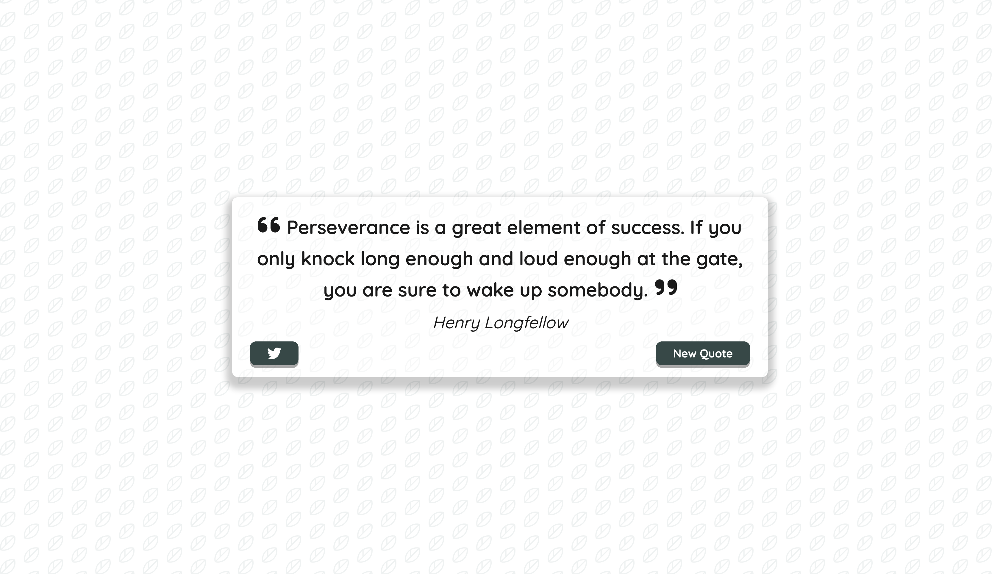
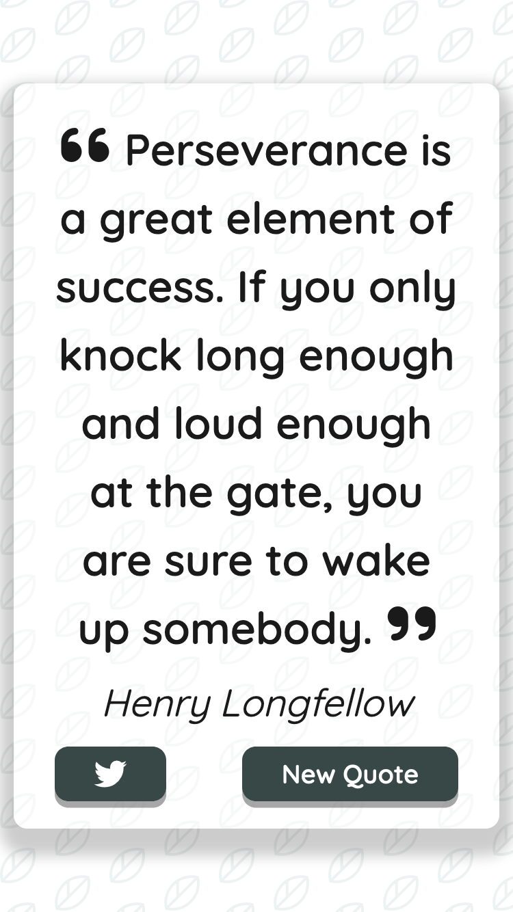

<p align="center">
  
</p>

<h1 align="center">Quote Generator</h1>

<div align="center">
  <h3>
    <a href="https://vivian-mca.github.io/quote-generator/">
      Live Demo
    </a>
</div>
<div align="center">
   Solution for a challenge from  <a href="https://zerotomastery.io/courses/javascript-projects/" target="_blank">zerotomastery.io</a>.
</div>
<br> <!-- omit in toc -->

## Table of contents <!-- omit in toc -->
- [Overview](#overview)
  - [About](#about)
  - [Screenshot](#screenshot)
- [My process](#my-process)
  - [Built with](#built-with)
  - [What I learned](#what-i-learned)
  - [Continued development](#continued-development)
  - [Useful resources](#useful-resources)
- [Acknowledgments](#acknowledgments)

## Overview

### About

This is a generator that randomly pulls quotes from a [Quotes API](https://type.fit/api/quotes).

Users should be able to:
1. View the optimal layout for the app depending on their device's screen size.
2. See hover states for all interactive elements on the page
3. Generate a new quote by clicking the **New Quote** button.
4. Pre-populate a Tweet with the generated quote by clicking the **Twitter** button.

### Screenshot

<p align="center"><em>Mobile design</em></p>

<p align="center">
  
</p>

## My process
### Built with

- Semantic HTML5 markup
- CSS CUBE methodology
- CSS custom properties
- CSS logical properties
- CSS flexbox
- CSS grid
- Asynchronous JavaScript

### What I learned

This was my first-time building a project using `fetch API` with `async/await`. 

```js
const getQuote = async () => {
  const apiUrl = "https://type.fit/api/quotes";
  try {
    const response = await fetch(apiUrl);
    apiQuotes = await response.json();
    newQuote();
  } catch (error) {
    alert(`Whoops, something went wrong. Try again later.`);
    console.log(error);
  }
};
```

With this challenge, I learned how to solve CORS issues by building a proxy server. Fortunately, the API I used for the final product did not have this issue.

Another first-time encounter I had while creating this project was using Twitter's [Tweet Web Intent Docs](https://developer.twitter.com/en/docs/twitter-for-websites/tweet-button/guides/web-intent) to pre-populate a Tweet with the generated quote (code snippet below).

```js
const tweetQuote = () => {
  const twitterUrl = `https://twitter.com/intent/tweet?text=${quoteText.textContent} - ${authorText.textContent}`;
  // Opens twitter page in new tab
  window.open(twitterUrl, "_blank");
};
```

Overall, this project was a great learning experience and made me feel slightly more confident utilizing `async/await`.

### Continued development

Other ideas for this project include:
- [ ] Use a different API to generate quotes
- [ ] Implement a filter feature to filter quotes by category or by length
- [ ] Pre-populate a post for various social media sites with the generated quote

### Useful resources
- [CSS Logical Properties and Values](https://css-tricks.com/css-logical-properties-and-values/) - This is a good resource for learning about CSS Logical Properties and Values.
- [CUBE CSS documentation](https://cube.fyi/) - From the docs: "CUBE CSS is a CSS methodology that’s orientated towards simplicity, pragmatism and consistency. It’s designed to work with the medium that you’re working in—often the browser—rather than against it."
- [Every Layout](https://every-layout.dev/) - Extremely helpful resource for simplifying CSS layouts.
- [Modern CSS Reset](https://piccalil.li/blog/a-modern-css-reset/)
- [Responsively App](https://responsively.app/) - This DevTool helps in responsive web development. It allows you to see mirrored user-interactions across all devices.

## Acknowledgments
- [@xtopolis](https://github.com/xtopolis) - My ever-so patient mentor - Thank you so much for your patience and support. I appreciate you taking the time to do code reviews and provide feedback.